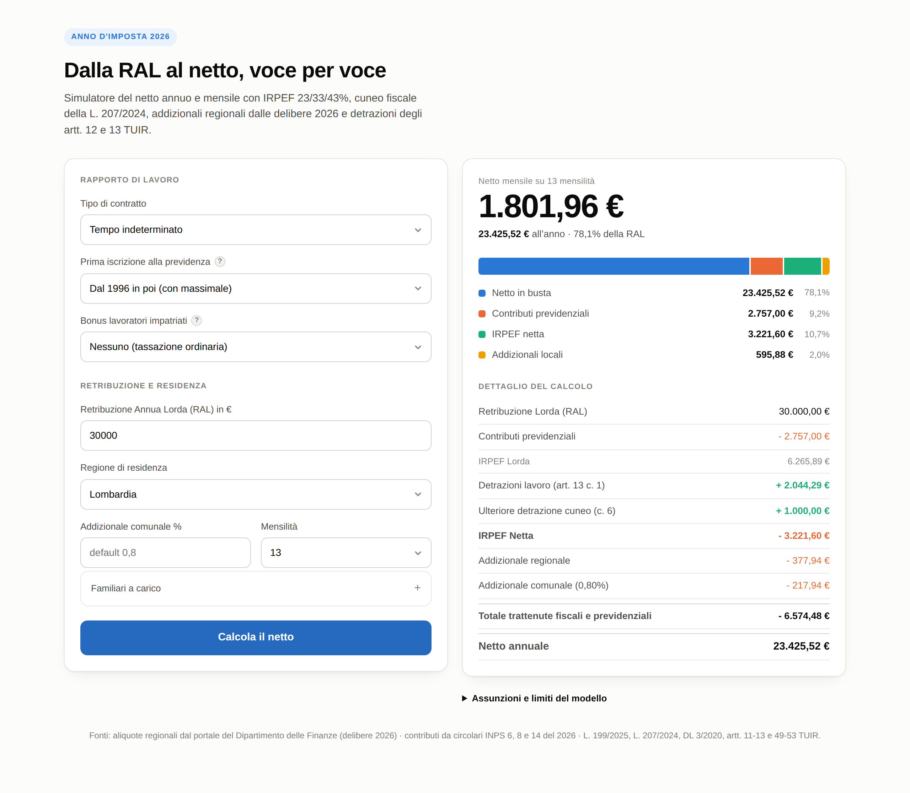

# Dalla RAL al netto — simulatore fiscale 2026

Calcolatore web che, a partire dalla retribuzione annua lorda, restituisce il netto annuo e mensile mostrando **ogni singola trattenuta**: contributi previdenziali, IRPEF lorda, detrazioni, addizionali regionale e comunale, cuneo fiscale e trattamento integrativo.

**▶ [Apri il calcolatore](https://francesc38c03.github.io/Calcolatore-netto-2026/)**



---

## Cosa copre

| Dimensione | Casi gestiti |
|---|---|
| Contratti | indeterminato, determinato, apprendistato professionalizzante, co.co.co., partita IVA |
| Regimi | ordinario (IRPEF progressiva) e forfettario (imposta sostitutiva 5% / 15%, 9 coefficienti di redditività) |
| Previdenza | FPLD privato, Gestione Separata (3 posizioni), artigiani, commercianti, cassa professionale parametrica |
| Territorio | 21 fra regioni e province autonome, con le aliquote delle delibere 2026, più addizionale comunale |
| Famiglia | coniuge, figli 21-29 anni con quota di carico, ascendenti conviventi |
| Agevolazioni | cuneo fiscale L. 207/2024, trattamento integrativo (entrambe le fasce), regime impatriati |

## Come funziona il calcolo

L'ordine delle operazioni è la parte in cui i simulatori sbagliano più spesso, perché tre grandezze diverse vengono spesso confuse in una sola:

```
RAL
 − contributi previdenziali    (base fermata al massimale)
 ─────────────────────────────────────────────────────────
 = reddito complessivo
     IRPEF lorda per scaglioni    23% / 33% / 43%
   − detrazioni       art. 13 + art. 12 + cuneo c. 6
   = IRPEF netta      floor a zero: l'eccedenza si perde
   − addizionali      solo se l'IRPEF netta è positiva,
                      sul reddito complessivo, non
                      ridotto dalle detrazioni
 ─────────────────────────────────────────────────────────
 + somma cuneo c. 4 e trattamento integrativo
   erogazioni in denaro: si sommano al netto,
   non riducono l'imposta
 = NETTO
```

Tre punti che non sono intuitivi e che il modello rispetta:

- **Sopra il massimale contributivo il minuendo resta la RAL.** L'imponibile previdenziale si ferma a 122.295 €, quello fiscale no. Confondere i due su una RAL da 150.000 € significa perdere quasi 12.000 € di IRPEF.
- **Le addizionali non seguono le detrazioni.** La base è il reddito complessivo al netto dei soli oneri deducibili (art. 50 c. 2 D.Lgs. 446/1997), ma non sono dovute se l'imposta netta è zero. È un `if` sull'esito, non sul reddito.
- **Il cuneo si calcola sul reddito al lordo dell'esenzione impatriati** (art. 1 c. 9 L. 207/2024), mentre l'IRPEF si calcola su quello ridotto. Sono due basi diverse nello stesso conto.

## Le discontinuità sono reali

Scandendo la RAL a passi di 10 € il netto **cala** in tre punti all'aumentare del lordo. Non sono bug: sono soglie secche di legge.

| RAL | Effetto | Causa |
|---|---|---|
| 9.000 → 9.100 | +1.200 € | l'imposta lorda supera 1.880 € e scatta il trattamento integrativo |
| 9.300 → 9.400 | −318 € | il reddito supera 8.500 (cuneo 7,1% → 5,3%) e nascono le addizionali |
| 16.500 → 16.600 | −123 € | reddito oltre 15.000: cuneo 5,3% → 4,8% |
| 27.500 → 27.600 | +65 € | reddito oltre 25.000: maggiorazione dell'art. 13 c. 1.1 |
| 38.500 → 38.600 | −61 € | reddito oltre 35.000: la maggiorazione sparisce |

L'aliquota marginale effettiva media risulta 7,7% fino a 15.000, 37,3% fra 15.000 e 28.000, **53,0% fra 28.000 e 50.000** e 50,9% oltre. Che la fascia intermedia superi quella alta è corretto: lì si sommano il 33%, i contributi e il décalage di due detrazioni.

## Verifica

I test non confrontano il codice con sé stesso. Ci sono tre livelli:

```bash
cd test
node test.js          # 67 assert sulle singole funzioni e sui punti di rottura
node dump.js          # esegue il motore su 1.090 casi e ne riversa le voci
python3 oracolo.py    # confronta con un'implementazione indipendente in Python
python3 invarianti.py # controlli strutturali e curva dell'aliquota marginale
```

`oracolo.py` è una riscrittura del calcolo **fatta dalle norme**, con struttura dati e funzioni diverse dal JavaScript: serve a intercettare gli errori di trascrizione, che un test scritto sullo stesso codice non vedrebbe. Confronta 10.288 valori su 1.090 combinazioni di contratto, regime, gestione, regione, reddito e carichi familiari.

`invarianti.py` verifica ciò che deve valere sempre a prescindere dalle formule: quadratura delle voci, IRPEF netta non negativa, addizionali assenti quando l'imposta è zero, prelievo entro limiti plausibili, e scansione della curva marginale a passi di 100 €.

### Confronto con calcolatori di terze parti

Su RAL 30.000, Lombardia, comunale 0,8%, senza carichi:

| Voce | Questo calcolatore | Fonte esterna A | Fonte esterna B |
|---|---|---|---|
| Contributi | 2.757,00 | 2.757 | 2.757 |
| Imponibile | 27.243,00 | 27.243 | 27.243 |
| IRPEF lorda | 6.265,89 | 6.266 | 6.266 |
| Detrazione art. 13 | 2.044,29 | 1.979 | ~1.766 |
| Addizionale regionale | 377,94 | 424 | ~358 |
| Netto annuale | 23.425,52 | 23.314 | ~23.167 |

Le differenze si concentrano su due voci, entrambe riconducibili a una norma precisa:

- **65 €** sulla detrazione da lavoro: l'art. 13 c. 1.1 TUIR prevede una maggiorazione per reddito fra 25.000 e 35.000, che le due fonti non applicano.
- **46,36 €** sull'addizionale regionale: la fonte A la calcola sui 30.000 di RAL, mentre l'art. 50 c. 2 D.Lgs. 446/1997 individua come base il reddito complessivo al netto degli oneri deducibili, cioè 27.243.

Lo scarto torna: `23.314,16 + 65 + 46,36 = 23.425,52`.

## Fonti

Ogni valore è tracciato in **[docs/fonti.md](docs/fonti.md)**, con la norma e il punto esatto che implementa. Le principali:

- **Aliquote regionali**: ricerca per Regione del [Dipartimento delle Finanze](https://www1.finanze.gov.it/finanze2/dipartimentopolitichefiscali/fiscalitalocale/addregirpef/sceltaregione.htm), anno d'imposta 2026, consultata regione per regione. Non sono state usate tabelle aggregate di terze parti: quelle verificate erano non datate e in disaccordo con le delibere.
- **Contributi**: circolari INPS 6/2026 (minimali e massimali), 8/2026 (Gestione Separata), 14/2026 (artigiani e commercianti).
- **IRPEF e cuneo**: L. 199/2025 (bilancio 2026), L. 207/2024 art. 1 commi 4-9, DL 3/2020 art. 1, artt. 11-13 e 49-53 TUIR.

## Assunzioni

Sono elencate nel pannello "Assunzioni e limiti del modello" in fondo alla pagina, dove le legge chi usa il calcolatore. Le principali: reddito da una sola fonte, proiezione su 365 giorni senza ragguaglio al periodo di lavoro, nessun onere deducibile o detraibile oltre a quelli di legge, dipendente privato non dirigente.

## Struttura

```
index.html          il calcolatore: pagina singola, nessuna dipendenza a runtime
docs/fonti.md       tracciamento norma → riferimento → implementazione
test/test.js        67 assert sulle funzioni del motore
test/dump.js        matrice di 1.090 casi
test/oracolo.py     implementazione indipendente di confronto
test/invarianti.py  invarianti strutturali e curva marginale
test/scan.js        scansione fine alla ricerca di inversioni del netto
```

Il calcolo e la presentazione sono separati: le funzioni del motore sono pure e restituiscono numeri, `testataRisultato` e `creaRigaHTML` sono le uniche a produrre HTML. È per questo che i test possono caricare la pagina e chiamare il motore direttamente, senza un browser.

## Licenza

MIT.
